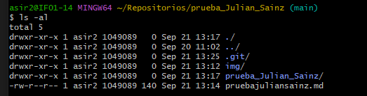
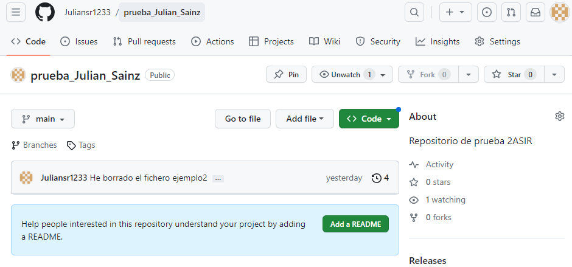
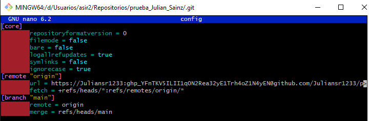
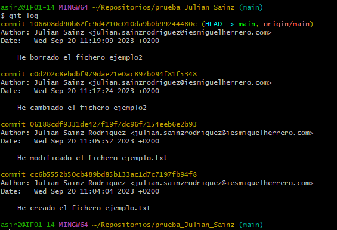
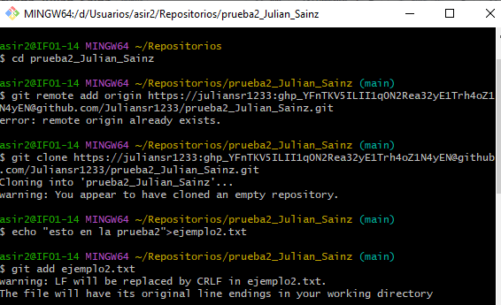
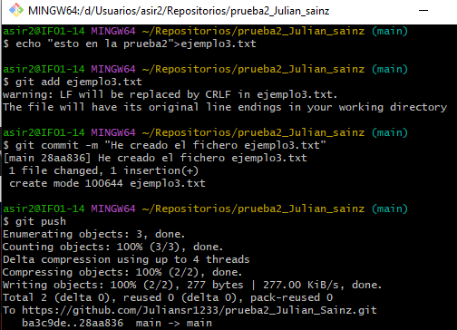
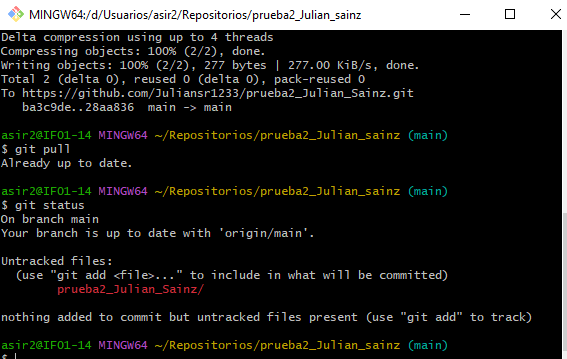
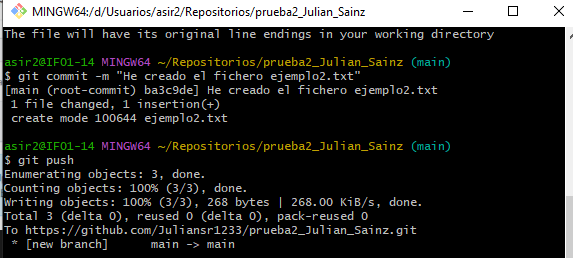
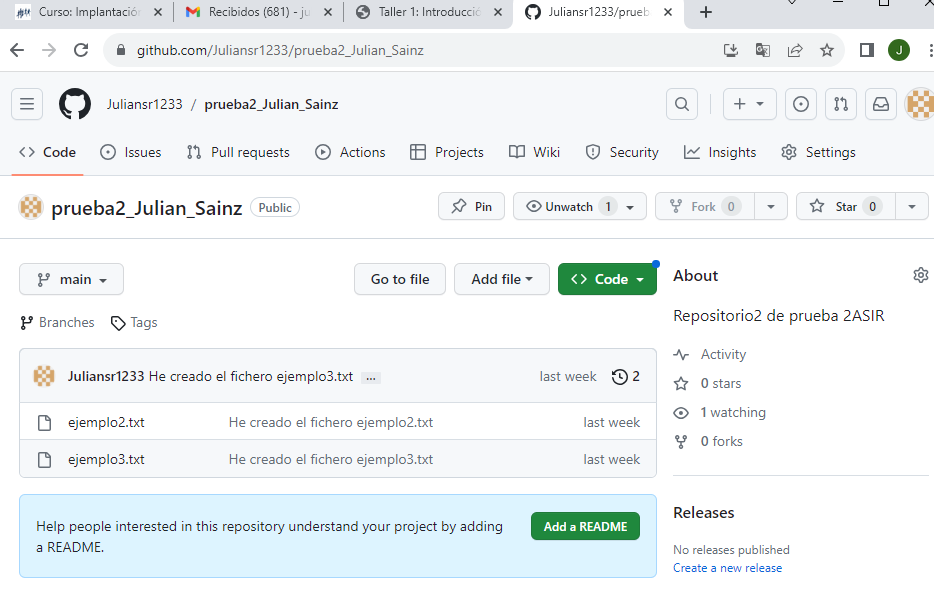

# Taller 1
## Creamos el repositorio:  
### Se crea con el comando mkdir seguido del nombre dentro de la carpeta repositorios.

## Repositorio desde GitHub:

## Ver el contenido del fichero .git/config:

## Ver los commits que has realizado:

## Creamos repositorio prueba2_Julian

## Creamos archivo

##

## Repositorio remoto

## Comprobamos que está bien
