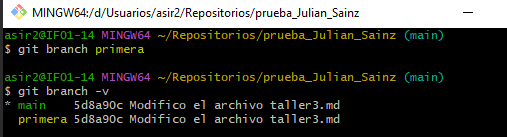
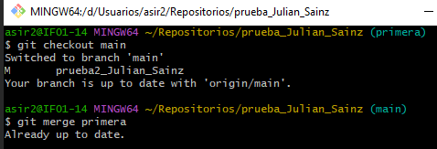
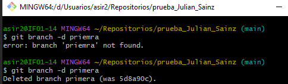
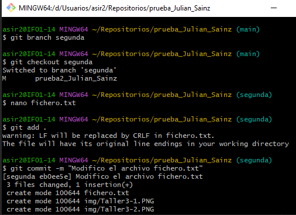
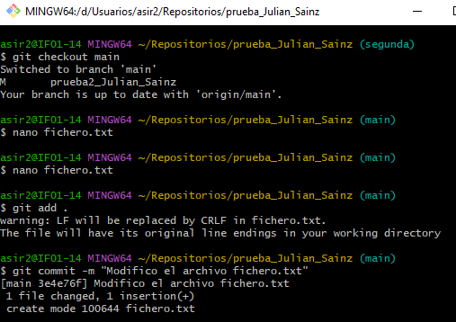
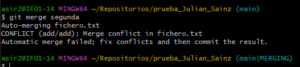
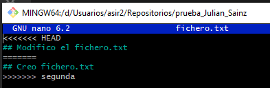
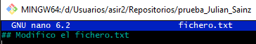
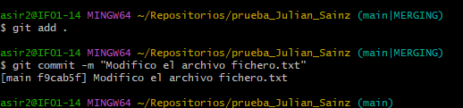

## Esto es el taller3.md
Creamos la rama que se llame primera y vemos todas las ramas que tenemos:

Creamos un nuevo fichero en esta rama y la fusionamos con la principal. No se produjo ningún conflicto.

Borramos la rama primera:

Creamos la rama que se llame segunda y modificamos un fichero en ella para producir un conflicto al unirlo a la rama principal:

Sincornizamos la rama segunda en el remoto y solucionamos el conflicto:

